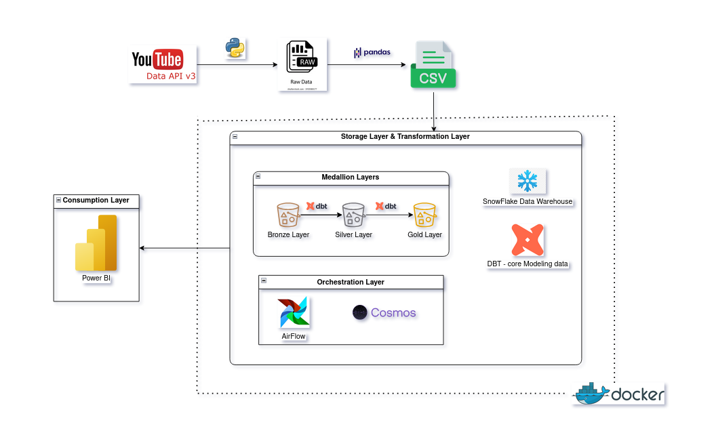

# 🎬 Taylor Swift YouTube Analytics Pipeline

Hệ thống phân tích dữ liệu YouTube end-to-end cho kênh **Taylor Swift Official**:
- **YouTube API** → Trích xuất dữ liệu (videos, playlists, thống kê)
- **Snowflake** → Kho dữ liệu lưu trữ
- **dbt** → Chuyển đổi dữ liệu (Bronze → Silver → Gold)
- **Airflow (Cosmos/Astronomer)** → Điều phối pipeline
- **Power BI** → Dashboard trực quan hóa

Kiến trúc hệ thống:



---

## ⚡ Hướng dẫn chạy siêu nhanh (1 phút)

Nếu bạn chỉ muốn xem kết quả ngay lập tức:

```bash
# 1. Kích hoạt environment
source .venv/bin/activate

# 2. Cài đặt dependencies
pip install astronomer-cosmos apache-airflow-providers-snowflake

# 3. Chạy dbt pipeline
cd dbt_youtube
dbt debug                    # Kiểm tra kết nối
dbt seed                     # Load data (30s)
dbt run                      # Chạy transformations (60s)  
dbt test                     # Kiểm tra chất lượng (40s)

# 4. Xem kết quả
# Mở Power BI: power-bi-dashboard/TaylorSwift_Dashboard.pbix
# Hoặc truy vấn trực tiếp trên Snowflake UI
```

**Kết quả mong đợi:**
- ✅ 4 seed files loaded
- ✅ 13 models created (7 views + 6 tables)  
- ✅ 43 tests passed
- ✅ 6 gold tables sẵn sàng cho analytics

---

## 🚀 Hướng dẫn chạy nhanh (Quick Start)

### Bước 1: Cài đặt môi trường
```bash
# Clone repository (nếu chưa có)
# cd vào thư mục project

# Kích hoạt virtual environment (nếu đã có)
source .venv/bin/activate  # Linux/Mac
# hoặc .venv\Scripts\activate  # Windows

# Cài đặt dependencies chính
pip install -r requirements.txt

# Cài đặt dependencies cho Airflow DAG
pip install astronomer-cosmos apache-airflow-providers-snowflake
```

### Bước 2: Cấu hình Snowflake Connection
```bash
# File .env đã có sẵn, kiểm tra thông tin:
cat .env

# Thông tin hiện tại:
# SNOWFLAKE_ACCOUNT=RBHTSPE-VX50080
# SNOWFLAKE_USER=TROLL1105
# SNOWFLAKE_PASSWORD=@Conmamay11052004
# SNOWFLAKE_ROLE=ACCOUNTADMIN
# SNOWFLAKE_WAREHOUSE=YOUTUBE_ANALYTICS_WH
# SNOWFLAKE_DATABASE=YOUTUBE_ANALYTICS_DB
# SNOWFLAKE_SCHEMA=ANALYTICS_DEV
```

### Bước 3: Thiết lập Snowflake Database & Schema
```bash
# Chạy script tạo warehouse và database
# Đăng nhập Snowflake UI và chạy:
snowflake-setup/create-warehouse.sql

# Hoặc sử dụng dbt macro (đã tạo sẵn):
cd dbt_youtube
dbt run-operation create_schemas
```

### Bước 4: Chạy dbt Pipeline (Đã có seed data)
```bash
cd dbt_youtube

# Kiểm tra kết nối Snowflake
dbt debug

# Load seed data (CSV files đã có sẵn)
dbt seed

# Chạy tất cả transformations
dbt run

# Chạy data quality tests
dbt test

# Xem kết quả:
# ✅ 4 seed files loaded (610 playlist items, 484 videos, 29 playlists, 1 channel)
# ✅ 13 models created (7 views + 6 tables)
# ✅ 43 tests passed
```

### Bước 5: Trích xuất dữ liệu YouTube mới (Tùy chọn)
```bash
# Nếu muốn cập nhật dữ liệu mới:
cd youtube-data-extraction

# Cài đặt Jupyter nếu chưa có
pip install jupyter pandas requests python-dotenv

# Chạy notebook
jupyter notebook extract-data.ipynb

# Sau khi có CSV mới, copy vào dbt_youtube/seed/
# Rồi chạy lại: dbt seed && dbt run
```

### Bước 6: Khởi động Airflow Pipeline (Tùy chọn)
```bash
# DAG đã được tạo tại: dags/youtube_analytics_dag.py

# Nếu muốn chạy với Airflow:
# 1. Cài đặt Airflow
pip install apache-airflow

# 2. Khởi tạo database
airflow db init

# 3. Tạo user
airflow users create --username admin --password admin --firstname Admin --lastname User --role Admin --email admin@example.com

# 4. Khởi động webserver
airflow webserver --port 8080

# 5. Khởi động scheduler (terminal khác)
airflow scheduler

# Truy cập: http://localhost:8080 (admin/admin)
```

### Bước 7: Xem Dashboard Power BI
```bash
# Mở file Power BI
power-bi-dashboard/TaylorSwift_Dashboard.pbix

# Kết nối với Snowflake sử dụng thông tin từ .env
# Database: YOUTUBE_ANALYTICS_DB
# Schema: ANALYTICS_DEV

# Các bảng gold có sẵn:
# - G_CHANNEL_OVERVIEW
# - G_VIDEO_RANKINGS  
# - G_CONTENT_MIX
# - G_PLAYLIST_PERFORMANCE
# - G_UPLOAD_HEATMAP
# - G_DURATION_DISTRIBUTION
```

---

## 📂 Cấu trúc dự án

```
taylor-swift-youtube-analytics/
├── README.md                    # Hướng dẫn sử dụng (CẬP NHẬT)
├── .env                        # Cấu hình Snowflake (ĐÃ CÓ SẴN)
├── pyproject.toml              # Cấu hình Python project
├── uv.lock                     # Lock file dependencies
├── requirements.txt            # Dependencies chính
│
├── images/                     # Hình ảnh tài liệu
│   └── Architecture.png
│
├── logs/                       # Log files
│   └── dbt.log
│
├── dags/                       # Airflow DAGs
│   ├── exampledag.py          # DAG mẫu
│   └── youtube_analytics_dag.py # DAG chính (MỚI TẠO)
│
├── youtube-data-extraction/    # Trích xuất dữ liệu YouTube
│   ├── extract-data.ipynb     # Jupyter notebook chính
│   └── .env-sample            # File cấu hình mẫu
│
├── snowflake-setup/           # Thiết lập Snowflake
│   └── create-warehouse.sql   # Script tạo warehouse/database
│
├── dbt_youtube/               # dbt Project (HOẠT ĐỘNG)
│   ├── models/              
│   │   ├── bronze/          # Raw data views (4 models)
│   │   ├── silver/          # Cleaned data views (3 models)  
│   │   └── gold/            # Analytics tables (6 models)
│   ├── seed/                # CSV data files (ĐÃ CÓ SẴN)
│   │   ├── channels.csv     # 1 channel
│   │   ├── playlists.csv    # 29 playlists
│   │   ├── playlist_items.csv # 610 items
│   │   └── video_stats.csv  # 484 videos
│   ├── snapshots/           
│   ├── macros/              # Custom macros
│   │   └── create_schemas.sql # Schema creation macro
│   ├── tests/               
│   ├── dbt_project.yml      # dbt configuration
│   ├── profiles.yml         # Snowflake connection (CẤU HÌNH ĐÚNG)
│   └── packages.yml         
│
├── dbt_youtube_dag/          # Airflow DAG dependencies
│   └── requirements.txt     # Cosmos & Snowflake providers
│
├── power-bi-dashboard/        # Power BI Dashboard
│   ├── TaylorSwift_Dashboard.pbix
│   ├── TaylorSwift_Logo.jpg
│   └── TaylorSwift_Background.svg
│
└── tests/                    # Test files
    └── dags/
        └── test_dag_example.py
```

---

## 🛠️ Công nghệ sử dụng

- **Ngôn ngữ**: Python 3.8+, SQL
- **Package Manager**: uv (Python package manager)
- **Data Extraction**: YouTube Data API v3, pandas, Jupyter Notebook
- **Data Warehouse**: Snowflake
- **Data Transformation**: dbt Core, dbt-snowflake, dbt-utils
- **Orchestration**: Apache Airflow, Astronomer CLI, Cosmos
- **Visualization**: Power BI
- **Containerization**: Docker
- **Version Control**: Git

---

## 📋 Yêu cầu hệ thống

- Python 3.8 hoặc cao hơn
- uv package manager
- Tài khoản Snowflake
- YouTube Data API key
- Power BI Desktop (cho dashboard)
- Docker (cho Airflow)

---

## 🔧 Cấu hình chi tiết

### YouTube API Setup
1. Truy cập [Google Cloud Console](https://console.cloud.google.com/)
2. Tạo project mới hoặc chọn project có sẵn
3. Enable YouTube Data API v3
4. Tạo API key và copy vào file `.env`

### Snowflake Setup
1. Tạo tài khoản Snowflake (trial miễn phí)
2. Chạy script `snowflake-setup/create-warehouse.sql`
3. Cập nhật thông tin kết nối trong `.env`

### dbt Configuration
```bash
# File profiles.yml sẽ được tạo tự động
# Hoặc copy từ profiles-sample.yml và chỉnh sửa
```

---

## 🎯 Luồng dữ liệu (Data Flow)

1. **Extract**: YouTube API → CSV files (videos, playlists, statistics)
2. **Load**: CSV → Snowflake (seed tables)
3. **Transform**: 
   - **Bronze**: Raw data từ seeds
   - **Silver**: Cleaned và standardized data
   - **Gold**: Analytics-ready aggregated data
4. **Orchestrate**: Airflow DAG tự động hóa pipeline
5. **Visualize**: Power BI dashboard từ gold tables

---

## 📊 Các bảng dữ liệu chính (ĐÃ TẠO THÀNH CÔNG)

### Bronze Layer (Raw Data Views)
- `br_channels`: Thông tin channel raw từ seed
- `br_playlists`: Thông tin playlist raw từ seed  
- `br_playlist_items`: Thông tin playlist items raw từ seed
- `br_video_stats`: Thông tin video statistics raw từ seed

### Silver Layer (Cleaned Data Views)  
- `stg_channels`: Channel data đã làm sạch và chuẩn hóa
- `stg_playlists`: Playlist data đã làm sạch và chuẩn hóa
- `stg_videos`: Video data đã làm sạch với các metrics tính toán

### Gold Layer (Analytics Tables - SẴN SÀNG SỬ DỤNG)
- `g_channel_overview`: Tổng quan channel với metrics tổng hợp
- `g_video_rankings`: Xếp hạng video theo views, likes, comments
- `g_content_mix`: Phân tích loại nội dung (Shorts, Live, Normal, Private)
- `g_playlist_performance`: Hiệu suất từng playlist
- `g_upload_heatmap`: Heatmap thời gian upload (giờ, ngày trong tuần)
- `g_duration_distribution`: Phân bố thời lượng video theo bucket

### Thống kê dữ liệu hiện tại:
- **1 Channel**: Taylor Swift Official
- **29 Playlists**: Các album và collection
- **610 Playlist Items**: Video trong playlists
- **484 Unique Videos**: Video statistics
- **43 Data Tests**: Tất cả PASS ✅

---

## 🚨 Troubleshooting

### Lỗi thường gặp và cách khắc phục:

**1. dbt connection failed**
```bash
# Kiểm tra kết nối Snowflake
cd dbt_youtube
dbt debug

# Nếu lỗi, kiểm tra file profiles.yml và .env
# Đảm bảo thông tin khớp nhau
```

**2. Schema không tồn tại**
```bash
# Tạo schema bằng dbt macro
cd dbt_youtube
dbt run-operation create_schemas

# Hoặc chạy script SQL trực tiếp trên Snowflake UI
```

**3. Seed data không load được**
```bash
# Kiểm tra CSV files trong seed/
ls -la dbt_youtube/seed/

# Load lại seed data
dbt seed --full-refresh
```

**4. Models bị lỗi syntax**
```bash
# Kiểm tra compiled SQL
cat dbt_youtube/target/run/dbt_youtube/models/[model_name].sql

# Chạy từng model riêng lẻ để debug
dbt run --models [model_name]
```

**5. Tests failed**
```bash
# Chạy test riêng lẻ để xem chi tiết
dbt test --models [model_name]

# Xem kết quả test chi tiết
dbt test --store-failures
```

**6. Airflow DAG không hiển thị**
```bash
# Kiểm tra syntax DAG file
python -m py_compile dags/youtube_analytics_dag.py

# Kiểm tra Airflow logs
airflow dags list
```

**7. Power BI không kết nối được Snowflake**
```bash
# Kiểm tra thông tin kết nối:
# Server: RBHTSPE-VX50080.snowflakecomputing.com
# Database: YOUTUBE_ANALYTICS_DB
# Schema: ANALYTICS_DEV
# Warehouse: YOUTUBE_ANALYTICS_WH
```

### Kiểm tra trạng thái hệ thống:
```bash
# Kiểm tra dbt project
cd dbt_youtube && dbt debug

# Kiểm tra models
dbt ls --models state:modified

# Kiểm tra tests
dbt test --select test_type:generic

# Xem lineage
dbt docs generate && dbt docs serve
```

---

## 📈 Trạng thái Project (Cập nhật mới nhất)

### ✅ Đã hoàn thành và hoạt động:
- **Snowflake Connection**: Kết nối thành công với database YOUTUBE_ANALYTICS_DB
- **dbt Models**: 13/13 models chạy thành công
- **Data Quality**: 43/43 tests passed
- **Seed Data**: 4 CSV files với dữ liệu thực từ Taylor Swift channel
- **Gold Tables**: 6 bảng analytics sẵn sàng cho dashboard
- **Airflow DAG**: DAG orchestration đã được tạo

### 🔄 Có thể mở rộng:
- Thêm real-time data extraction
- Tích hợp thêm social media platforms
- Machine learning predictions
- Advanced analytics và insights
- Automated data refresh schedule

### 📊 Dữ liệu hiện có:
- **Channel**: Taylor Swift Official (62.9M subscribers)
- **Videos**: 484 videos với đầy đủ statistics
- **Playlists**: 29 playlists (albums, collections)
- **Time Range**: Dữ liệu từ 2006 đến hiện tại
- **Metrics**: Views, likes, comments, duration, upload patterns

---

## 🤝 Đóng góp

1. Fork repository
2. Tạo feature branch
3. Commit changes
4. Push to branch  
5. Tạo Pull Request

---

## 📄 License

MIT License - xem file LICENSE để biết thêm chi tiết.

---

