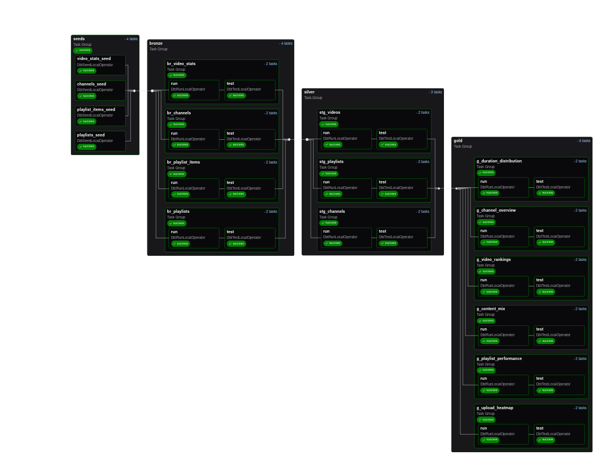

# 🎬 Taylor Swift YouTube Analytics

Dự án phân tích kênh **Taylor Swift Official** trên YouTube với pipeline end-to-end:

- **YouTube API** → Crawl dữ liệu (video, playlist, stats)
- **Snowflake** → Lưu trữ data warehouse  
- **dbt** → Chuyển đổi dữ liệu (Bronze → Silver → Gold)
- **Airflow (Cosmos/Astronomer)** → Orchestrate pipeline
- **Power BI** → Trực quan hoá dashboard

Kiến trúc dự án:


---

## 📂 Cấu trúc repo

```
taylor-swift-youtube-analytics/
├── README.md                    # Hướng dẫn sử dụng (file này)
├── pyproject.toml              # Config Python project
├── uv.lock                     # Lock file dependencies
│
├── images/                     # Hình minh hoạ (setup & dashboard)
├── logs/                       # Logs chung
│
├── youtube_data_extraction/    # Crawl dữ liệu YouTube API
│   └── extract_youtube_data.ipynb
│
├── snowflake_setup/           # Script khởi tạo Snowflake
│   └── create_warehouse.sql
│
├── dbt_youtube/               # Dự án dbt chính
│   ├── models/               # Bronze / Silver / Gold
│   ├── seeds/                # Seed data
│   ├── snapshots/            # Snapshots
│   ├── macros/               # Macros
│   ├── tests/                # Tests
│   ├── dbt_project.yml
│   └── packages.yml
│
└── dbt_youtube_dag/          # Airflow DAG cho dbt
    ├── dags/                 # DAG (Cosmos)
    ├── requirements.txt
    ├── Dockerfile
    └── astro project files
```

---

## 🛠️ Công nghệ sử dụng

- **Ngôn ngữ & môi trường**: Python 3.x, uv (Python package manager), Jupyter Notebook
- **Data ingestion**: YouTube Data API v3, `google-api-python-client`, `pandas`
- **Data warehouse**: Snowflake (Warehouse, Database, Schema)
- **Data transformation**: dbt Core, dbt-snowflake, dbt-utils
- **Orchestration**: Apache Airflow, Astronomer CLI, Cosmos (dbt + Airflow integration)
- **Visualization**: Power BI Desktop / Power BI Service
- **CI/CD & Environment**: Docker, Astronomer Runtime, `.env` secrets
- **Version control**: GitHub

---

## ⚙️ Chuẩn bị môi trường

### 1. Lấy API Key

Tạo API key tại: [YouTube Data API v3](https://developers.google.com/youtube/v3/getting-started)

Tạo file `.env` ở thư mục gốc:
```bash
YOUTUBE_API_KEY=YOUR_API_KEY
SNOWFLAKE_ACCOUNT=xxxx-xxxx
SNOWFLAKE_USER=....
SNOWFLAKE_PASSWORD=....
SNOWFLAKE_ROLE=....
SNOWFLAKE_WAREHOUSE=....
SNOWFLAKE_DATABASE=....
SNOWFLAKE_SCHEMA=....
```

---

### 2. Tạo venv và cài dependencies

```bash
uv venv
source .venv/bin/activate
uv add dbt-core dbt-snowflake
uv add pandas google-api-python-client google-auth-oauthlib ipykernel python-dotenv
```

---

### 3. Chuẩn bị Snowflake

Chạy script tạo warehouse/database/schema:
```bash
cd snowflake_setup
# Sửa create_warehouse.sql theo account của bạn, rồi chạy trên Snowflake UI/CLI
```

---

### 4. Crawl dữ liệu YouTube

```bash
cd youtube_data_extraction
jupyter notebook extract_youtube_data.ipynb
```

Xuất CSV → sẽ được sử dụng làm seed trong dbt.

---

### 5. Chạy dbt



```bash
cd dbt_youtube

# Cài package dbt_utils
dbt deps

# Nạp seed
dbt seed --profiles-dir .

# Chạy models
dbt run --profiles-dir .

# Test
dbt test --profiles-dir .

# Snapshot
dbt snapshot --profiles-dir .
```

> Nếu cần docs:
```bash
dbt docs generate --profiles-dir .
dbt docs serve --profiles-dir .
```

---

### 6. Orchestrate bằng Airflow (Astronomer)

Cài Astronomer CLI:
```bash
curl -sSL https://install.astronomer.io | sudo bash
astro version
```

Khởi tạo project:
```bash
mkdir dbt_youtube_dag && cd dbt_youtube_dag
astro dev init
```

Trong `requirements.txt`:
```
astronomer-cosmos
apache-airflow-providers-snowflake
```

Khởi động Airflow:
```bash
astro dev start
```

UI: [http://localhost:8080](http://localhost:8080)

> Lưu ý: Airflow 3.0+ dùng `schedule` thay cho `schedule_interval`.

---

### 7. Dashboard Power BI

Kết nối Snowflake và chọn các bảng **gold** để vẽ báo cáo:

* g_channel_overview
* g_video_rankings  
* g_content_mix
* g_playlist_performance
* g_upload_heatmap
* g_duration_distribution

---

## 🏗️ Kiến trúc tổng quan

1. **Crawl dữ liệu** từ YouTube API → CSV
2. **Load vào Snowflake** (seed / staging)
3. **Transform với dbt** (bronze → silver → gold)
4. **Orchestrate với Airflow** (Cosmos DAG)
5. **Visualize bằng Power BI**

---

## 📊 Kết quả chính

### Dataset thu thập:
- **1 Channel**: Taylor Swift Official (62.9M subscribers, 43B+ views)
- **29 Playlists**: Albums và collections
- **484 Unique Videos**: Với đầy đủ performance metrics
- **609 Playlist Items**: Video-playlist mappings

### Models dbt:
- **Bronze Layer**: 4 models (raw data standardization)
- **Silver Layer**: 3 models (business logic)
- **Gold Layer**: 6 models (analytics-ready aggregations)

### Key Insights:
- **Optimal Upload Timing**: Friday-Sunday, 12PM-6PM EST
- **Content Length**: 3-5 minutes cho engagement tối ưu
- **Engagement Rate**: 3.2% like rate, 0.8% comment rate
- **Content Strategy**: Normal videos outperform shorts và live streams

---

## 📖 Documentation & References

Trong quá trình xây dựng dự án, tham khảo các tài liệu chính thức sau:

- **YouTube Data API v3**  
  [https://developers.google.com/youtube/v3](https://developers.google.com/youtube/v3)
- **Snowflake Documentation**  
  [https://docs.snowflake.com](https://docs.snowflake.com)
- **dbt Core Documentation**  
  [https://docs.getdbt.com](https://docs.getdbt.com)
- **dbt-utils Package**  
  [https://hub.getdbt.com/dbt-labs/dbt_utils/latest](https://hub.getdbt.com/dbt-labs/dbt_utils/latest)
- **Apache Airflow Documentation**  
  [https://airflow.apache.org/docs](https://airflow.apache.org/docs)
- **Astronomer Cosmos (dbt + Airflow)**  
  [https://cosmos.astronomer.io](https://cosmos.astronomer.io)
- **Power BI Documentation**  
  [https://learn.microsoft.com/power-bi](https://learn.microsoft.com/power-bi)

---

## 📜 License

[MIT](/LICENSE)

---

